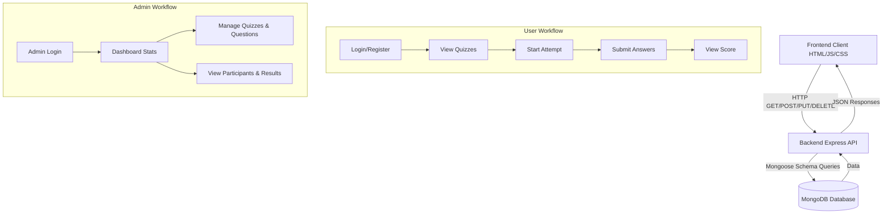

# IEEE SRHU SB Quiz App 🚀

A comprehensive, full-stack Aptitude Quiz platform built for the IEEE SRH Fusion Branch. This application allows administrators to create and manage quizzes while providing a seamless quiz-taking experience for participants with real-time scoring and attempt tracking.

## 🌟 Features

### 👨‍🎓 For Participants (Users)
- **Authentication:** Secure user registration and login.
- **Dashboard:** View active quizzes and read instructions.
- **Quiz Interface:** Interactive, time-bound quiz engine.
- **Results:** Instant feedback and scoring upon quiz submission.

### 🛡️ For Administrators (Admins)
- **Admin Dashboard:** Overview of platform statistics (total users, active quizzes, etc.).
- **Quiz Management:** Create, edit, activate/deactivate, and delete quizzes.
- **Question Bank:** Add, edit, and delete questions for specific quizzes.
- **Participant Tracking:** View all registered participants and their details.
- **Result Analysis:** Detailed attempt reports, score tracking, and result exports.

## 🛠️ Tech Stack

### Frontend (Client-side)
- **HTML5 & CSS3:** Semantic markup and custom styling.
- **Vanilla JavaScript (ES6+):** Dynamic DOM manipulation and API integration.

### Backend (Server-side)
- **Node.js & Express.js:** Robust RESTful API architecture.
- **MongoDB & Mongoose:** NoSQL database for flexible and scalable data storage.
- **Authentication:** JSON Web Tokens (JWT) & bcryptjs for secure password hashing.
- **Security:** Helmet (HTTP headers), express-rate-limit (DDoS protection), CORS.
- **Utilities:** Multer (file uploads), PDF-Parse (processing PDF data if applicable).

## 🏗️ Project Architecture & Workflow

The application follows a decoupled client-server architecture, making it easy to scale and deploy frontend and backend independently.



## 📁 Folder Structure

```text
Quiz app/
├── frontend/                 # Static Frontend files
│   ├── index.html            # Landing page
│   ├── login.html            # User login
│   ├── register.html         # User registration
│   ├── quiz.html             # Quiz interface
│   ├── css/                  # Stylesheets
│   ├── js/                   # Frontend JavaScript (API calls)
│   └── admin/                # Admin Panel HTML views
│
└── backend/                  # Node.js Server & API
    ├── package.json          # Backend dependencies & scripts
    ├── .env                  # Environment variables
    ├── server.js             # Express app entry point
    ├── config/               # Database connection (db.js)
    ├── models/               # Mongoose schemas (User, Quiz, Question, Attempt)
    ├── controllers/          # Business logic for routes
    ├── routes/               # API endpoint definitions
    ├── middleware/           # Auth and security checks
    └── utils/                # Helper functions (scoring, seeding)
```

## 🚀 Installation & Setup

### Prerequisites
- [Node.js](https://nodejs.org/) (v16 or higher)
- [MongoDB](https://www.mongodb.com/) (Local instance or MongoDB Atlas)
- [Git](https://git-scm.com/)

### 1. Clone the repository
```bash
git clone https://github.com/ankitramola11/quiz-app.git
cd quiz-app
```

### 2. Backend Setup
```bash
cd backend
npm install
```

Create a `.env` file in the `backend` directory with the following variables:
```env
PORT=5000
MONGODB_URI=your_mongodb_connection_string
JWT_SECRET=your_jwt_secret_key
NODE_ENV=development
```

Start the backend development server:
```bash
npm run dev
```
*The server will run on `http://localhost:5000`.*

### 3. Frontend Setup
Because the frontend consists of static files, the backend server is configured to serve them statically during local development. 
Simply open your browser and navigate to:
- **User Portal:** `http://localhost:5000/`
- **Admin Portal:** `http://localhost:5000/admin/login.html`

*Note: For production deployment, you can deploy the `frontend` folder to a static host (like Vercel or Netlify) and update the API base URLs in the frontend JS files to point to your deployed backend URL.*

## 🔒 API Endpoints Overview

| Route | Method | Description | Access |
|-------|--------|-------------|--------|
| `/api/auth/register` | POST | Register a new user | Public |
| `/api/auth/login` | POST | Authenticate user & get token | Public |
| `/api/quizzes` | GET | Get active quizzes | User |
| `/api/attempts/:id/start` | POST | Start a quiz attempt | User |
| `/api/attempts/:id/submit`| POST | Submit final quiz answers | User |
| `/api/admin/quizzes` | GET/POST/PUT | Manage Quizzes | Admin |
| `/api/admin/questions`| GET/POST/PUT | Manage Questions | Admin |
| `/api/admin/results` | GET | View all quiz attempts/results| Admin |

---
*Built with ❤️ for the IEEE SRHU STUDENT Branch.*
